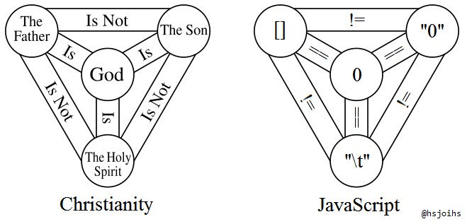
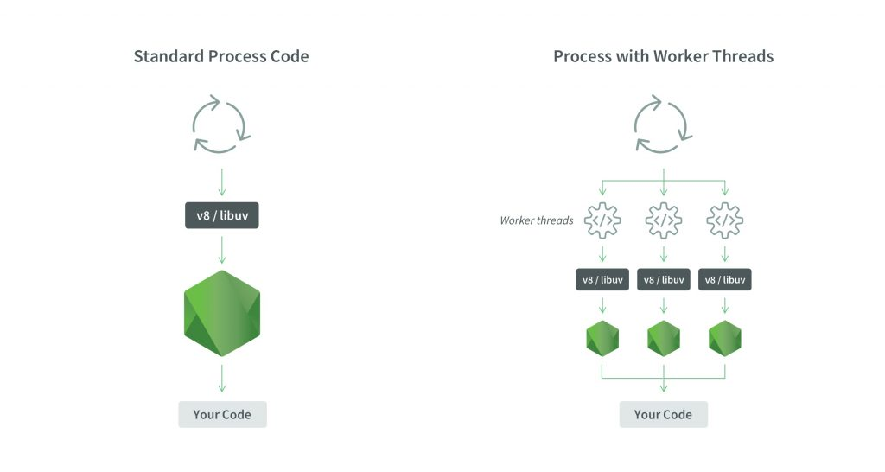

# JavaScript et son Ecosystème

## Session 1 :  

- Approche théorique du langage : Gramaire & syntaxe, Call Stack, Callback Queue, Event Loop et Web API
- Des API sympas : Promesse, callback, exception, storage et notification

<br/>  <br/>
      
Enigme : N = R<sup>*</sup> x f<sub>p</sub> x n<sub>e</sub> x f<sub>l</sub> x f<sub>i</sub> x f<sub>c</sub> x L  (1961)

---

### JavaScript - Un p'tit peu de vocabulaire

Description du langage :

* Programmation :
    * fonctionnelle
    * objet (mais sans classe -> _"`prototype based`"_)
    * événementielle (synchrone -> Dès qu'on fait un `emit(...)`, les listeners sont tous appelés :loudspeaker:)
* Typage dynamique & faible
* Synchrone

Particularités : callback, `promises`, `async/await` (Node.js only), `"use strict;"`, `closure`, etc.

Types primitifs : `boolean`, `number`, `string`, `undefined`, `null`  
Le reste, c'est des `Objects` (ou des `map` <- même les tableaux)

---

#### Quelques pièges

1) JavaScript ajoute automatiquement des ; à la fin des instruction

```javascript
function f1() {
  return
  [
    "a",
    123,
    true
  ];
}

function f2() {
  return  [
    "a",
    123,
    true
  ];
}

var result1 = f1();
var result2 = f2();
console.log(result1, result2);
```

safékoi ?

Source : [Comprendre enfin JavaScript](https://www.youtube.com/watch?v=PSeU1IJztkI)

---

#### Quelques pièges

2) Les opérateurs == et !=



Source : [Javascript WTF](https://javascriptwtf.com/)


---

#### Quelques pièges

3) Les tableaux

```javascript
var a = [];
a["0"] = "this"; a["1"] = "is"; a["2"] = "an"; a["0030"] = "array"; a["z040"] = "."; 
console.log(a);
console.log(Object.keys(a));
console.log(a["0030"]);
console.log(a["z040"]);

a.length = 2;
console.log(a);
console.log(Object.keys(a));

a.push("lol");
console.log(a);
```
  
* Note<sup>1</sup> : `0030` et `z040` ne sont pas considérées comme un index du tableau !  
* Note<sup>2</sup> : utiliser les méthodes de `array`  
* Note<sup>3</sup> : il existe d'autres méthodes  (géniales) comme `filter` et `sort` que l'on va voir de suite...  
  
Source : [Comprendre enfin JavaScript](https://www.youtube.com/watch?v=PSeU1IJztkI)

---

#### Programmation fonctionnelle

```javascript
let sessions = [
  {id: 1, date: new Date()},
  {id: 2, date: new Date()},
  {id: 3, date: new Date('2020-01-01')},
  {id: 4, date: new Date('1970-01-01')}
];

// Et maintenant , on trie par date ;) 
```

---

#### Programmation fonctionnelle (1)

```javascript
let sessions = [
  {id: 1, date: new Date()},
  {id: 2, date: new Date()},
  {id: 3, date: new Date('2020-01-01')},
  {id: 4, date: new Date('1970-01-01')}
];

// Solution 1 : OKLM - pas PF
function filterByDate(aSession, aDate) {
  return aSession.date > aDate;
}

let filteredSession = [];
for (var i = 0; i < sessions.length; i++) {
  if (filterByDate(sessions[i], new Date())) filteredSession.push(sessions[i]);
}

console.log(filteredSession);

```

---

#### Programmation fonctionnelle (2)

```javascript
let sessions = [
  {id: 1, date: new Date()},
  {id: 2, date: new Date()},
  {id: 3, date: new Date('2020-01-01')},
  {id: 4, date: new Date('1970-01-01')}
];

// Solution 2 : PF mais tranquille
let filteredSession = sessions.filter(session => session.date > new Date());
console.log(filteredSession);

// Solution 2.2
let filterByDate = function (session) {
  return session.date > new Date();
};
filteredSession = sessions.filter(filterByDate);
console.log(filteredSession);

```

---

#### Programmation fonctionnelle (3)

```javascript
let sessions = [
  {id: 1, date: new Date()},
  {id: 2, date: new Date()},
  {id: 3, date: new Date('2020-01-01')},
  {id: 4, date: new Date('1970-01-01')}
];

// Solution 3 : PF LE KIFF TOTAL
let filterByDate = (aDate) => (aSession) => aSession.date > aDate;
let filterSuppToday = filterByDate(new Date());
var filteredSession = sessions.filter(filterSuppToday);
console.log(filteredSession);
```
Note : il est aussi possible d'ajouter directement une méthode à `session` sans passer par la définition d'une fonction "externe"

* [Un article sympa concernant JS et la PF](https://medium.com/@hkairi/programmation-fonctionnelle-avec-javascript-df4dafdbecda)
* [Il y a aussi des vidéos cools](https://www.youtube.com/results?search_query=javascript+programmation+fonctionnelle)

---

#### Programmation objet

```javascript
var Personne = function(nom) {
  this.nom = nom;
};

// J'aurai pu définir cette fonction dans la fonction précédente
Personne.prototype.direUnePhraseIntelligente = function() {
  console.log(this.nom + " : \"On m'appelle l'ovni\"");
};

// Pas de prototype ?
Personne.direAutreChose = function() {
  console.log(this.nom + " : \"Coucou toi\"");
}

var jul = new Personne("JuL"); // On peut aussi utiliser Object.create() (en fonction du navigateur)

// Un p'tit peu d'héritage ?
var Chanteur = function(nom, groupe) {
  Personne.call(this, nom); // Appel Personne() en donnant this
  this.groupe = groupe;
};

Chanteur.prototype = Object.create(Personne.prototype);
Chanteur.prototype.constructor = Chanteur;

var robertSmith = new Chanteur("Bob", "The Cure");

jul.direUnePhraseIntelligente();
robertSmith.direUnePhraseIntelligente();
jul.direAutreChose(); // Erreur !

console.log(jul, robertSmith, Personne);
```

[-> Version ECMAStript 2015](https://developer.mozilla.org/fr/docs/Web/JavaScript/Reference/Classes) (avec le mot clef `Class`)

---

#### `"use strict;`

Au début du fichier ou dnas une fonction

* ECMAScript 5 (pris en charge par la majeure partie des navigateurs)
* Variable non déclarée = exception levée
* Unicité des propriétés d'un objet et des noms d'arguments d'une foncion
* Fonctions déclarées au bon endroit (tout en haut)

  
Enigme : P\*r\*d\*\*e de  F\*rm* (1950)  

---

#### `closure` ou fermeture (1)

* Fonctions qui se "souviennent" de l'environnement dans lequel elles ont été créées

```javascript
function init() {
  var nom = "Mozilla"; // nom est une variable locale de init
  function afficheNom() { // afficheNom est une fonction interne de init
    console.log(nom);
  }
  afficheNom();
};
init();
```

`nom` n'est pas disponible en dehors de `init()`. 

Source : [MDN web docs](https://developer.mozilla.org/fr/docs/Web/JavaScript/Closures)

---

#### `closure` ou fermeture (2)

```javascript
function faireAddition(x) {
  return function(y) {
    return x + y;
  };
};

var ajout5 = faireAddition(5);
var ajout10 = faireAddition(10);

console.log(ajout5(2));  // 7
console.log(ajout10(2)); // 12
```

Source : [MDN web docs](https://developer.mozilla.org/fr/docs/Web/JavaScript/Closures)

---

#### `closure` ou fermeture (3)

Les `closures` permettent de "créer" des méthodes privées. Ce qui nous fait revenir sur la notion de module JavaScript.

```javascript
var logger = (function() {

  function warn(element) {
    var aDate = new Date();
    console.warn(aDate + ' - ' + element);
  }

  function info(element) {
    var aDate = new Date();
    console.info(aDate + ' - ' + element);
  }

  return {
    warn: warn,
    info: info
  };
})();

logger.info("is ok");
logger.warn("wut ?");
```

Source : [MDN web docs](https://developer.mozilla.org/fr/docs/Web/JavaScript/Closures)

---

### JavaScript - Le Runtime


Source : [The Main Event… Loop (Medium)](https://medium.com/codezillas/the-main-event-loop-3928adcd2413)

---

###  Browser API 


Source : [The Main Event… Loop (Medium)](https://medium.com/codezillas/the-main-event-loop-3928adcd2413)

---

### Multiple queues

* **Task queue** : il en existe souvent plusieurs au sein d'un navigateur
* **Microtasks queue** : créé par les `promises` & `MutationObserver` et dédié à des petites tâches (faiblement voire pas du tout pris en charge par IE/Edge/Netscape #lol)
* Et potentiellement d'autres (ex: **Render queue**)

Priorisation (généralement) : `MQ > TQ`  => Attention aux blocages !  


---

### Multiple queues

#### safékoissa ?

```javascript
console.log('script start');

setTimeout(function() { // Callback
  console.log('setTimeout');
}, 0);

Promise.resolve().then(function() { // Promise
  console.log('promise1');
}).then(function() {
  console.log('promise2');
});

console.log('script end');
```

### Exemple de chose bizarre à cause de ce Runtime étrange

[Tasks, microtasks, queues and schedules](https://jakearchibald.com/2015/tasks-microtasks-queues-and-schedules/)

---


### Browser API : y'a quoi ?

- Manipulation du DOM
- Récupérer des données (`XMLHttpRequest` ou `Fetch` API)
- Dessiner des :cat: (Canvas et WebGL)
- Device API (pour les :iphone:)
- Stockage (StorageAPI = sessionStorage & localStorage)
- [Web Crypto](https://www.youtube.com/watch?v=GzMbbWXfQZE) !
- [etc...](https://developer.mozilla.org/en-US/docs/Web/API)

### Il existe aussi des API tierces
Twitter, Facebook, Mastodon, Youtube, Telegram  etc.

Source : [MDN web docs](https://developer.mozilla.org/en-US/docs/Learn/JavaScript/Client-side_web_APIs/Introduction)

---

### Comment fait Node.js pour être asynchrone ?
- Browser API -> bibliothèque C++ I/O async ([libuv](https://github.com/libuv/libuv))
- [Thread Worker](https://www.jesuisundev.com/comprendre-les-worker-threads-de-nodejs/) avec la version 10 de Node.js (expérimental)
- les _clusters_ et _child process_


### Les Thread Worker



Source : [Thread Worker (jesuisundev)](https://www.jesuisundev.com/comprendre-les-worker-threads-de-nodejs/)

---

## Exemple un peu plus concret

Go to VS Code

---

## Quelques chiffres ?

JavaScript (et Python) on gagné ?
* [Index TIOBE](https://www.tiobe.com/tiobe-index//)
* [PYPL (country=FR)](https://pypl.github.io/PYPL.html?country=FR)
* [GitHub - Octoverses](https://octoverse.github.com/projects#languages)
* [Stackoverflow - Survey](https://insights.stackoverflow.com/survey/)
* [The RedMonk Programming Language Rankings](https://redmonk.com/sogrady/2019/03/20/language-rankings-1-19/)
* [W3Techs](https://w3techs.com/) (finalement, non)

